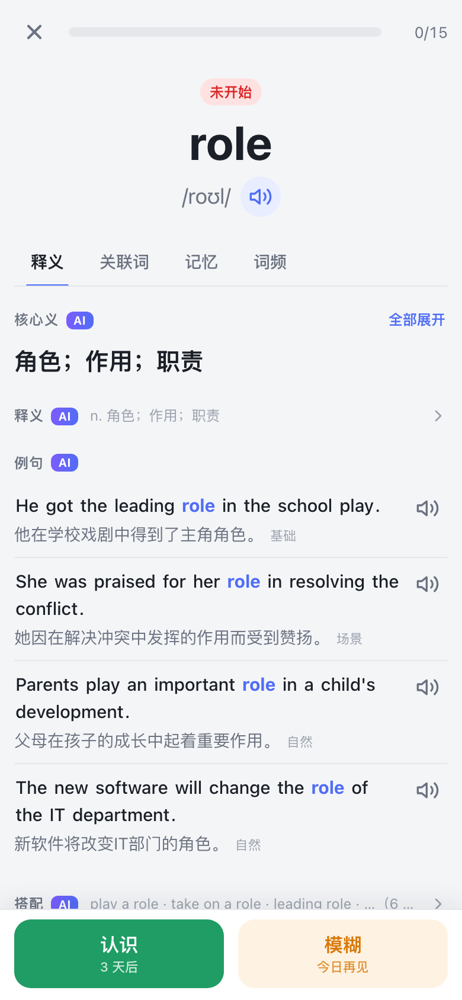
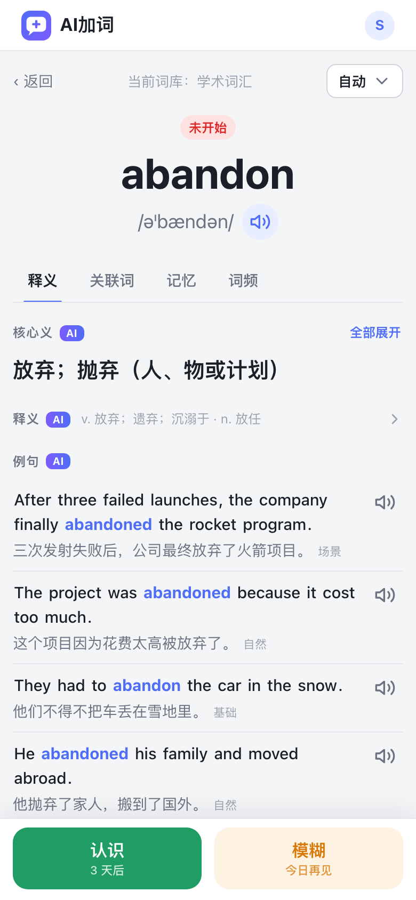
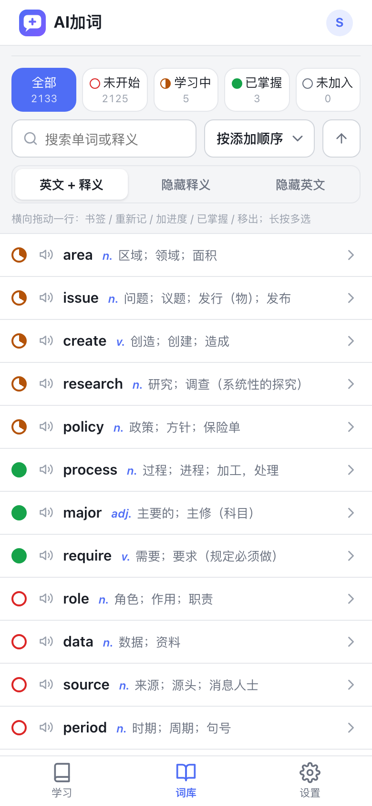

# AI加词

精简版背单词网站：内置 / 导入词库 → 每日按计划学习 → 认识 / 模糊打分 → 间隔重复安排复习。词条的核心义、义项、例句、搭配、句型、辨析、词族、助记、词源由 AI 离线填充、全局共用；用户可以写备注和反馈问题，不修改词条本身。仅中文界面，面向海外英语学习者；一套代码同时照顾手机与桌面，手机上可加到主屏幕当应用用。

Next.js 15（App Router）+ TypeScript + Prisma + PostgreSQL 16，前后端同仓，应用就是仓库根目录。

**在线使用：[jiaci.app](https://jiaci.app)**（邮箱验证码登录，免费；词条与内置词库在 [jiaci.app/dict](https://jiaci.app/dict) 公开可查，不用登录）

> **代码与数据结构全部开源（[MIT](LICENSE)）。** 不只是应用源码：数据库表结构与迁移（`prisma/`）、词条 AI 字段的定义与校验契约（`src/lib/ai/schema.ts`）、内置词库的词表与选词规则（`lists/`、`src/lib/wordbook-rules.ts`），以及词典导入 / 词库构建 / AI 填充 / 发音生成的离线脚本（`scripts/`）都在这个仓库里。可以照此自行部署一套，也可以只拿数据模型与词表去做自己的东西。

<p align="center">
  
  
  
  
</p>

> **English** · Jiaci (AI加词) is a minimal vocabulary trainer for Chinese speakers learning English: pick a built-in or imported word list → study a daily queue of cards → rate each one *know* / *fuzzy* → [FSRS](https://github.com/open-spaced-repetition/ts-fsrs) schedules the reviews. Word entries (core meaning, senses, examples, collocations, word family, mnemonics, etymology) are pre-generated offline by an LLM and shared by all users; pronunciation is server-side neural TTS. Chinese UI only. Next.js 15 · TypeScript · Prisma · PostgreSQL. **Open source under MIT — the code *and* the data model** (database schema, word-entry field contracts, word lists, offline scripts) all live in this repo. Live at [jiaci.app](https://jiaci.app).


## 设计初衷

做一个边上班边学英语背单词的好工具。
尝试过众多背单词应用，也开通过会员，不过或多或少都不太满意，所以手搓了一个，力求简洁高效，满足个人学习需求。
后期可能会尝试收取一些费用或加少量广告，作为服务器和 AI 费用的补贴。


## 功能概览

| 模块 | 内容 |
|---|---|
| 登录 | 邮箱验证码，首次登录自动注册；长期登录，活跃自动续期 |
| 学习 | 首页显示当前词库与今日任务（待学新词 / 待复习 / 今日已完成）→ 学习卡片：正面只给拼写、音标、发音、学习记录与例句英文，点击屏幕显示答案 → 打分：认识 / 模糊，长按上滑 已掌握 / 重新记 → 今日完成、再学一组（额外新词）；桌面端有快捷键 |
| 单词详情 | 站内点词是从右侧滑入的全屏浮层，原页面的筛选与滚动位置不丢；刷新或直接打开链接是独立整页。顶部固定单词 / 音标 / 发音，其下四个 Tab（释义 / 关联词 / 记忆 / 词频）可点击或左右滑动切换；正文里的英文都能点，弹出小框看发音与释义；备注、反馈、加入我的词库、学习记录时间线、例句朗读、进入自动朗读、切换词条资料来源 |
| 词库 | 三个 Tab（正在学习 / 我的词库 / 内置词库），内置 / 导入 / 自建三类，21 本内置词库（高频三级、八套考试、学术词汇、常用短语与词组、海外生活六本）；导入 txt（每行一词）或手动添加 |
| 单词列表 | 每行进度饼图 + 小喇叭 + 单词 + 主释义；按状态筛选、中英搜索、五种排序、滚到底自动加载。「隐藏释义 / 隐藏英文」两种自测模式；横向拖动一行露出「取消 / 书签 / 重新记 / 加进度 / 已掌握 / 移出」，长按进入多选批量操作，操作可在几秒内撤销；书签记住停在哪个词和当时的筛选条件，下次一键跳回 |
| 公开词典 | `/dict/<单词>` 与 `/dict/book/<词库>` 不用登录即可查看：词条资料（去掉个人部分）与内置词库词表，供搜索引擎收录；分享出去的 `/word/…` 链接未登录时也会落到这里 |
| 设置 | 每日新词量、复习上限、学习顺序、新词顺序、口音、声音、例句小喇叭位置、自动发音、自动朗读、主题、词条资料来源、导出数据、注销，以及隐私政策与服务条款 |

学习算法用 FSRS（`ts-fsrs`）：按目标记忆保持率安排复习，难词密、简单词疏，间隔达到阈值自动转为已掌握。单词状态只用四色表示（已掌握绿 / 学习中黄 / 未开始红 / 未加入灰），正文里的单词不按状态着色。

## 目录结构

```
prisma/          数据模型、迁移与种子（系统配置初始值）
src/lib/         领域逻辑：scheduler.ts 调度、status.ts 四色状态、study.ts 队列与打分、
                 dict.ts 词典、wordbook-rules.ts 内置词库选词、word-view.ts 词条视图、
                 ai/ 字段契约与填充、tts/ 发音合成、auth.ts 登录、config.ts 系统配置、
                 client/ 浏览器端的请求、朗读与页面间通知
src/app/         api/ 为 Route Handlers，(app)/ 为登录后页面（@detail 是单词详情浮层的平行路由），
                 page.tsx 是未登录看到的落地页，login/ 登录，legal/ 隐私政策与服务条款，
                 robots.ts / sitemap.ts 只放公开页，globals.css 是整套样式的源头
src/components/  共用组件（单词详情、打分栏、滑动 Tab、饼图、弹层、导航壳）
scripts/         离线脚本：词典导入、内置词库构建、AI 字段填充、发音音频生成、内容数据同步、定期清理
lists/           内置词库的词表文件（考试大纲、学术与通用核心词表、场景词表、排除表、补充词典）
public/          图标与 PWA 清单、Service Worker、落地页截图（shots/）与分享卡片图（og.png）
tests/ e2e/      单元测试、端到端与截图脚本
```

## 本地开发

需要 Node.js 20+、Docker（或任意 PostgreSQL 16）。

```bash
# 1. 数据库
docker run -d --name aiword-pg \
  -e POSTGRES_PASSWORD=aiword -e POSTGRES_USER=aiword -e POSTGRES_DB=aiword \
  -p 127.0.0.1:5432:5432 postgres:16-alpine

# 2. 应用（在项目根目录）
cp .env.example .env        # 按需填写各项
npm install
npx prisma migrate deploy   # 建表
npm run db:seed             # 系统配置初始值
npm run dev                 # http://localhost:3000
```

没有配置邮件服务的 Key 时，开发环境的验证码直接显示在登录页上。线上要在 `.env` 里写 `SITE_URL`（对外地址），分享卡片、robots 与 sitemap 里的绝对地址都按它拼；登录页与 robots / sitemap 是构建时预渲染的，在别的机器上构建时那台机器的 `.env` 也要有。

| 命令 | 说明 |
|---|---|
| `npm run dev` / `build` / `start` | 开发 / 构建 / 生产启动 |
| `npm test` | 单元测试（调度算法、词典与选词规则、词条视图、AI 填充校验、发音文本、导入解析、限速、日期） |
| `npm run typecheck` / `npm run lint` | 类型与代码检查 |
| `npm run e2e` | 端到端 UI 测试（需先 `npm run dev`，使用本机 Chrome） |
| `npm run e2e:shots [-- 1280 900]` | 全页面截图回归，默认手机视口 |
| `npm run readme:shots` | 重新生成 README 与落地页用的截图（`public/shots/`，需本机有内置词库与 AI 资料） |

### 内容数据

建完表的数据库里没有词条和词库，按下面的顺序生成（都不调用付费接口）：

```bash
# 词典：下载 ECDICT 的 ecdict.csv 到 data/ecdict/，全量写入 dict_entry，再按规则筛入 word 表
npm run dict:load
npm run dict:sync

# 内置词库：按 scripts/wordbooks.ts 的定义 + lists/ 下的词表生成，可重复执行
npm run wordbooks:build -- --dry-run     # 先看每本的词数与缺词
npm run wordbooks:build
```

词条的 AI 资料用 `npm run ai:fill` 填充（需要在 `.env` 里配模型厂商的 Key，付费），发音音频用 `npm run audio:generate` 生成（Edge-TTS，免费，也可换成自托管的 Kokoro）；没有这两样应用照常可用——详情用词典释义兜底，发音缺文件时按需合成、再不行退到浏览器语音。各脚本的参数见文件头部注释。

## 设计要点

- **应用运行时不调用 AI**：词条的 AI 资料由离线脚本按学习维度拆成字段、经 zod 契约校验后写库，按模型厂商分表、全局共用；用户可在设置里选资料来源（自动 / DeepSeek / OpenAI），没有 AI 资料的词用词典字段兜底显示。
- **发音**：单词、例句与中文释义都播放服务端 MP3（预生成，缺失时按需合成），播放失败兜底浏览器 Web Speech；口音 × 声音四种组合。
- **可运营调整的参数集中在数据库配置表**，改库即生效，无需发版；密钥只放环境变量。
- **算法与状态是纯函数**：FSRS 调度、四色状态判定、选词规则都在 `src/lib/` 里，有单测覆盖；列表的筛选 / 搜索 / 排序 / 分页 / 计数全部下推到 SQL。
- **列表操作先本地生效、延迟提交**，几秒内可撤销；打分请求幂等，离线时暂存、恢复后重试。
- 样式是一套 CSS 变量体系（未用 Tailwind），支持浅色 / 深色主题、手机底部 Tab 与桌面顶部导航；基础 PWA，只缓存静态资源。

## 数据来源与致谢

- 词典数据来自 [ECDICT](https://github.com/skywind3000/ECDICT)（MIT）。
- 通用核心词表 NGSL 与学术词表 NAWL 来自 [newgeneralservicelist.org](https://www.newgeneralservicelist.org/)（Browne / Culligan / Phillips，CC BY-SA 4.0）；学术词表 AWL 来自 Coxhead (2000)。
- 考试词表参照公开大纲整理；各词表的出处写在 `lists/` 对应文件的头部。
- 间隔重复算法为 [FSRS](https://github.com/open-spaced-repetition/ts-fsrs)（`ts-fsrs`，MIT）。

## 许可

代码与数据结构均以 [MIT](LICENSE) 许可开源：应用源码、`prisma/` 下的数据库表结构与迁移、`src/lib/ai/schema.ts` 的词条字段契约、`scripts/` 下的离线脚本都可以自由使用、修改与再分发。`lists/` 下词表文件与词典数据的出处及各自的许可见上一节。
